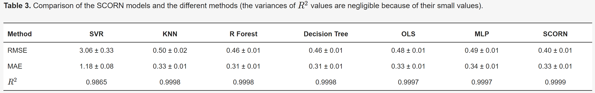

# SCORN

This directory contains the code for paper [SCORN: Sinter Composition Optimization with Regressive Convolutional Neural Network](https://www.mdpi.com/2673-6497/3/3/29/htm), which is accepted by MDPI Solids.


If you have any questions, please email to yz945@cornell.edu

### Reference

If you find it is helpful, please cite it as:

`
Junhui Li, Liangdong Guo and Youshan Zhang (2022). SCORN: Sinter Composition Optimization with Regressive Convolutional Neural Network. Solids. 2022; 3(3):416-429. https://doi.org/10.3390/solids3030029
`

Or in bibtex style:

```
@Article{li2022scorn,
AUTHOR = {Li, Junhui and Guo, Liangdong and Zhang, Youshan},
TITLE = {SCORN: Sinter Composition Optimization with Regressive Convolutional Neural Network},
JOURNAL = {Solids},
VOLUME = {3},
YEAR = {2022},
NUMBER = {3},
PAGES = {416--429},
URL = {https://www.mdpi.com/2673-6497/3/3/29},
ISSN = {2673-6497},
DOI = {10.3390/solids3030029}
}

```


To run the code

1. Open Matlab (Matlab2017a version or later should be fine)

    Run SCORN.m

2. Open  Jupyter Notebook (Jupyter Notebook 6.4.5version or later should be fine)

    Run Multi-output regression model.ipynb

3. We also provide the Pytroch and Tensorflow version of our SCORN model. 
   
   You can run SCORN_Pytorch.ipynb and SCORN_Tensorflow.ipynb. Due to different deep learning platforms, results from Pytroch and Tensorflow are slightly lower than that of the Matlab version.

## Figures
 
<p align="center">Comparision results </p>

